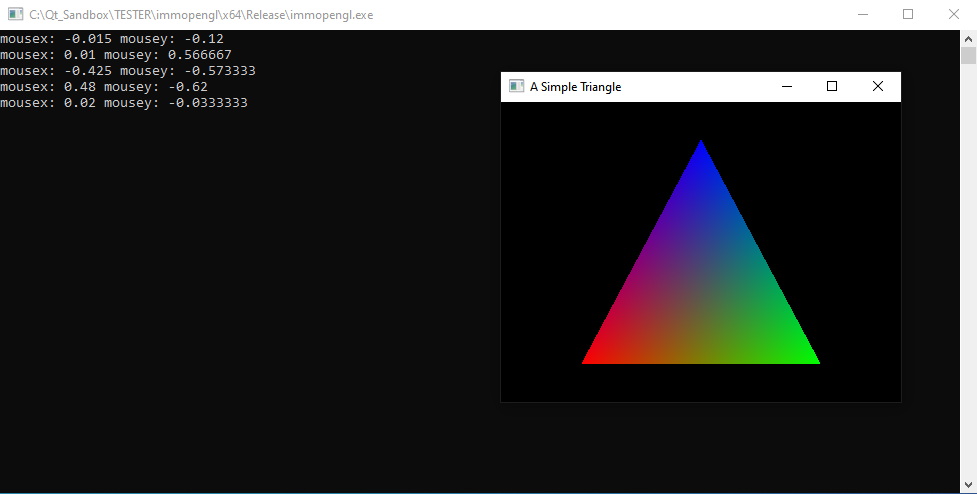

# Immediate Mode OpenGL Getting Started Project

This is a basic immediate mode OpenGL project based on FreeGlut.

Learn immediate mode OpenGL using the following resources:
* https://cs.lmu.edu/~ray/notes/openglexamples/
* https://www.ntu.edu.sg/home/ehchua/programming/opengl/CG_BasicsTheory.html

